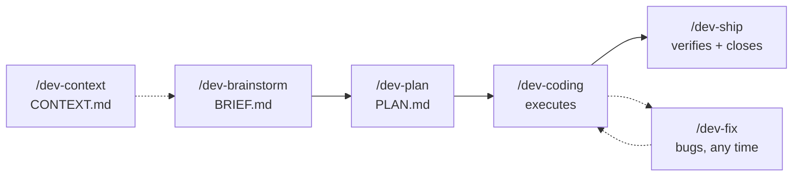

# solodev v2

> **Plan > Vibes.** Seven Claude Code skills for the solo dev who blurts the loose idea and wants engineering discipline coming back the other way.

*Versão em português: [README.md](README.md).*

```
/dev-context  ·  /dev-brainstorm  →  /dev-plan  →  /dev-coding  →  /dev-ship
  CONTEXT.md        BRIEF.md            PLAN.md       executes        verifies + closes
 (once per project)                                      ↑
                                                     /dev-fix  (bugs, any time)
```



Built on top of the original [solodev](https://github.com/calneymgp/solodev) (3 skills), extended to cover the full lifecycle. Claude Code format (`.claude/skills/`), content in Brazilian Portuguese (PT-BR) — this English README is the front door; the skills themselves speak PT-BR.

## What each one does

| Skill | When | What it delivers |
|-------|------|------------------|
| `/dev-context` | Project start / architecture changed | `CONTEXT.md` at the repo root: one-liner, architecture map, canonical glossary, conventions, invariants ("never do X"), commands, external boundaries. Runs once and updates on demand — not per feature |
| `/dev-brainstorm` | Raw, spoken, fuzzy idea | Understanding mirror → S/M/L triage → one-question-at-a-time grilling → `BRIEF.md` + Risk Radar |
| `/dev-plan` | BRIEF closed | Atomic `PLAN.md`: vertical slices, verifiable acceptance, effort, rollback for risky tasks, /clear points, demo script |
| `/dev-coding` | PLAN.md ready | Executes task by task with visible progress, scope guard, drift protocol, atomic `[task-XX]` commits |
| `/dev-fix` | Bug, any time | Trivial/real/architectural triage → fast mode or 6-phase loop (feedback loop → falsifiable hypotheses → probe → fix + regression → cleanup) |
| `/dev-ship` | Last task done / "is it ready?" | Full suite + Must-Haves + demo script + diff review (leftovers, bugs) + security lens + SUMMARY.md + archive |
| `/dev-help` | Lost in the flow | Reference card: the lifecycle, which skill to use now, where outputs live (one-shot, not a mode) |

## How it works

Each skill hands a concrete artifact to the next. The plan is external memory; the session is disposable.

- **`/dev-context`** builds the project's memory before any feature work. It generates `CONTEXT.md` at the repo root: a one-liner for the project, an architecture map (modules + responsibility), a canonical glossary (the domain vocabulary), conventions (naming / tests / errors), invariants ("never do X"), the commands (build / test / lint / run), and external boundaries. It runs once per project and is updated on demand when the architecture shifts — never per feature. The other skills cite it: when a BRIEF, plan, or review says "if the project has a CONTEXT.md, align to its vocabulary," this is the file they mean.
- **`/dev-brainstorm`** stress-tests the idea before any code. It mirrors back what it understood in 3 bullets, triages size (S/M/L), then grills one question at a time — always with a recommendation inline — exploring the codebase silently instead of asking what the code already answers, and aligning to `CONTEXT.md` if one exists. Output: `BRIEF.md` plus a top-3 Risk Radar.
- **`/dev-plan`** turns the BRIEF into an atomic `PLAN.md` — no code, only decisions, affected areas, and verifiable acceptance criteria (grep / test / build). Tasks are vertical slices, each demoable on its own, carrying effort and rollback. The plan marks /clear points so a fresh session can resume from the file alone.
- **`/dev-coding`** executes the plan task by task: reads `read_first` before editing, shows X/N progress, runs a scope guard (task bloated 2× → stop and re-plan) and a drift protocol (reality ≠ plan → record the truth in the plan), does vertical TDD (one test → one impl), commits atomically as `[task-XX]`.
- **`/dev-fix`** drops in for bugs with no plan needed — just diagnostic method: build a reproducible feedback loop first, rank falsifiable hypotheses, run one probe per hypothesis, fix with a regression test, clean up the traces.
- **`/dev-ship`** is the barrier between "tasks done" and "production-ready": full suite + Must-Haves + 60-second demo script + a reviewer's pass over the whole diff + a security lens on touched files, then `SUMMARY.md` and the plan archived.

`CONTEXT.md` lives at the **project root** — it's the project's long-lived memory, distinct from the per-feature artifacts. Those live in `.plans/<feature-slug>/`: `BRIEF.md`, `PLAN.md`, `DISCOVERY.md` (optional), `SUMMARY.md`.

## The v2 upgrades (vs. the original)

Each upgrade targets a specific way solo dev work goes sideways:

- **`/dev-context`** — a project-memory file (`CONTEXT.md`) the other skills align to. The glossary, invariants, and conventions live in one place, so brainstorm/plan/coding/ship don't re-derive (or contradict) the project's own vocabulary.
- **Understanding mirror** — before grilling, it reflects the spoken idea back in 3 bullets. Kills most misunderstandings on turn 1, before 10 turns of grilling head in the wrong direction.
- **S/M/L triage** — a small task gets no BRIEF; ceremony is a tax. A large task doesn't escape the grilling.
- **Product lens** — empty state, error, loading, permissions: the things a vibe coder forgets, the skill asks about.
- **Risk Radar** — every BRIEF closes with the top-3 "this is going to bite you" + mitigation.
- **effort + rollback per task** — the plan says what each task costs and how to undo the dangerous ones.
- **/clear points** — the plan marks where to reset context; PLAN.md is the external memory, the session is disposable.
- **Scope guard + drift protocol** — task bloated 2×? Implementation diverged from the plan? Stop, record, re-plan. The plan always tells the truth.
- **`/dev-fix`** — the diagnose loop is now its own skill: bugs don't need a plan, they need method.
- **`/dev-ship`** — "done" became a verified state: suite + Must-Haves + 60s demo + clean diff + security pass.
- **`/dev-help`** — an in-session reference card: which skill to use right now, without leaving the terminal.
- **Self-validation in CI** — `scripts/validate.mjs` checks skill frontmatter, manifests, and docs on every push. The suite that preaches verifiable criteria validates itself.

### Why these upgrades are awesome

The original solodev nailed the middle — brainstorm, plan, code. v2 fixes the two ends where solo projects actually rot, and adds a memory layer in front of all of it:

- **`/dev-context`** is the layer before the front end. Without shared project memory, every brainstorm re-invents the vocabulary and every plan risks contradicting the last. `CONTEXT.md` makes the glossary, conventions, and invariants explicit once, so the whole pipeline speaks the same language.
- The **front end** is where you talk yourself into the wrong thing. The understanding mirror, S/M/L triage, product lens, and Risk Radar force the vague idea to become explicit *before* it turns into messy code.
- The **back end** is where "it works on my machine" hides a half-built feature. `/dev-ship` makes *done* mean demonstrated, not felt — and `/dev-fix` makes a bug die by method instead of by a third lucky guess.

The through-line is **Karpathy's anti-LLM rules**: never assume in silence, surgery over rewrites, the minimum necessary, verifiable criteria over prose. The plan is external memory you can `/clear` against, so context never becomes the bottleneck.

## Installation

Three ways. Full detail in [INSTALL.md](INSTALL.md).

**1. Claude Code plugin (recommended)** — install via the marketplace, nothing to clone:

```
/plugin marketplace add Marcelover777/solodev-v2
/plugin install solodev-v2@solodev-v2
```

**2. Script (macOS / Linux / Windows):**

```bash
# macOS / Linux
git clone https://github.com/Marcelover777/solodev-v2 && cd solodev-v2
./install.sh
```

```powershell
# Windows (PowerShell)
git clone https://github.com/Marcelover777/solodev-v2; cd solodev-v2
.\install.ps1
```

**3. Manual** — copy the `skills/` directory to wherever Claude Code reads your skills. Per-OS steps in [INSTALL.md](INSTALL.md).

Once installed, the slash commands (`/dev-context`, `/dev-brainstorm`, `/dev-plan`, `/dev-coding`, `/dev-fix`, `/dev-ship`) are available in any Claude Code session.

## Workflow

```
0. > /dev-context       once per project (or when the architecture changes); out comes CONTEXT.md at the repo root
1. > /dev-brainstorm     speak the idea your way; out comes BRIEF.md (or straight to execution if it's an S)
2. > /dev-plan           out comes a self-sufficient PLAN.md
3. > /clear              (optional — the plan carries everything)
4. > /dev-coding         executes task by task; /dev-fix whenever something breaks
5. > /dev-ship           only finishes what it can demonstrate working
```

`CONTEXT.md` sits at the project root; the per-feature outputs live in `.plans/<feature-slug>/`: `BRIEF.md`, `PLAN.md`, `DISCOVERY.md` (optional), `SUMMARY.md`.

## Credits

Distilled from: [Matt Pocock — skills](https://github.com/mattpocock/skills), [OpenSpec](https://github.com/Fission-AI/OpenSpec), [get-shit-done](https://github.com/gsd-build/get-shit-done), [everything-claude-code](https://github.com/affaan-m/everything-claude-code), and Karpathy's anti-LLM rules. v2 is built on top of [calneymgp's solodev](https://github.com/calneymgp/solodev).

MIT — see [LICENSE](LICENSE).
