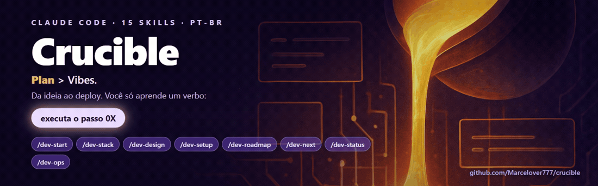
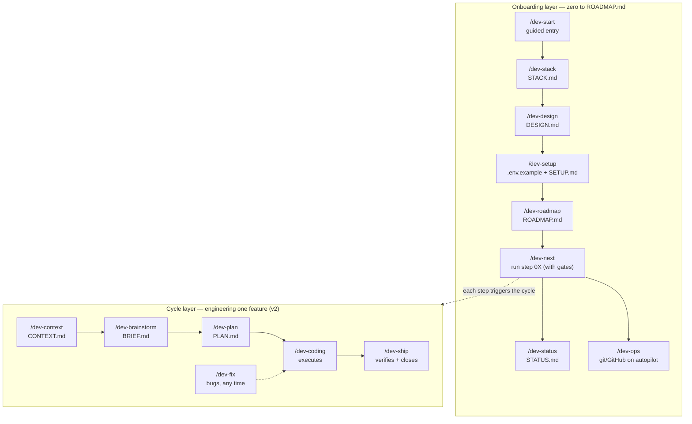

<p align="center">
  <a href="https://github.com/Marcelover777/crucible">
    
  </a>
</p>

# Forger

> **Plan > Vibes.** Fifteen Claude Code skills that take the beginner from a loose idea to a deployed project — learning **one verb**: *"run step 0X."*

*Versão em português: [README.md](README.md).*

You describe the idea your way. What comes back is not a yes-man that codes the first guess — it's a system that recommends your stack and explains every piece, scaffolds a project that already looks **designed** (not generic-bootstrap gray), maps every API key with the exact link, hands you a **numbered list of steps**, and then runs them one at a time. Each step stops at a gate if a key is missing and gives you the link to fix it. Underneath, every step triggers the same engineering discipline that runs a single feature: grill the idea, write an atomic plan, execute task by task, ship only what demonstrates working — always toward a complete, functional V1, not a throwaway MVP.

Two layers, one idea: the **onboarding** layer gets you from zero to a `ROADMAP.md`; the **cycle** layer (inherited from v2) is the engineering rigor each step triggers under the hood.

## The two layers



Fallback (for renderers without mermaid):

```
ONBOARDING   /dev-start → /dev-stack → /dev-design → /dev-setup → /dev-roadmap → "run step 0X" (/dev-next)
             guided       STACK.md     DESIGN.md      SETUP.md      ROADMAP.md      runs it, gates first
                                                                                         │
CYCLE (v2)   /dev-context → /dev-brainstorm → /dev-plan → /dev-coding → /dev-ship   ◀────┘ each step
             CONTEXT.md       BRIEF.md          PLAN.md     executes      verifies        triggers the cycle
                                                              ↑
                                                          /dev-fix  (bugs, any time)

PANEL        /dev-status (state + quality, any time)   ·   /dev-help (which command now)
```

Built on top of the original [solodev](https://github.com/calneymgp/solodev) (3 skills) and the full v2 lifecycle. Claude Code format (`.claude/skills/`), content in Brazilian Portuguese (PT-BR) — this English README is the front door; the skills themselves speak PT-BR.

## Never coded before? Start here

You only need to learn **one command**. The flow:

1. **`/dev-start`** — say your idea once. The guided entry mirrors it back, then chains stack → design → setup → roadmap, showing what it's building at each step. You end with a stack chosen, a project scaffolded that already looks designed, your keys mapped, and a numbered `ROADMAP.md`.
2. **`run step 01`** — that's it. `/dev-next` resolves the step, checks the gates, runs it, ticks the box, and prints *"next: run step 02."*
3. If a step needs an API key you don't have yet, it **stops** and hands you the exact link. Fix it, run again.
4. Lost at any point? **`/dev-status`** shows what's done, what has errors, and the quality of each part. **`/dev-help`** shows which command to use now.

No jargon, one decision at a time, nothing happens in silence. An advanced user skips `/dev-start` and calls the sub-skills directly.

## The 15 skills

Two layers. **Onboarding** takes you from zero to a numbered roadmap; **cycle** is the v2 engineering discipline each step triggers. **Reference** is the in-session map.

### Onboarding layer (new in v3)

| Skill | When | What it delivers |
|-------|------|------------------|
| `/dev-start` | Brand-new project / "I've never coded" | Guided entry: mirrors the idea, then chains `/dev-stack → /dev-design → /dev-setup → /dev-roadmap`, showing what it builds at each step. Ends with *"now just say: run step 01."* |
| `/dev-stack` | "Which stack / DB / where do I deploy / is it free?" | Infra & connectors advisor: infers or asks the archetype, recommends the default + the why in one line, offers one alternative, warns the free-tier gotchas, and **links official pricing — never invents a number**. Writes `STACK.md` (an ADR with the env vars each piece needs) |
| `/dev-design` | "Make it look good / pick the colors / no template vibe" | Instant aesthetics: for the web archetype, recommends and **scaffolds** Tailwind v4 + shadcn/ui + a tweakcn theme (reading `BRIEF.md` for tone). Writes `DESIGN.md` (tokens, installed components, naming) and emits the scaffold commands as a roadmap step. Non-web archetypes degrade gracefully |
| `/dev-setup` | "Where do I put the API key / create the .env" | Keys & integrations without getting lost: reads `STACK.md` + scans the code for env vars, then generates a richly annotated `.env.example` (what each var is, where to get it, required vs optional) and a `SETUP.md` checklist with the exact link per key. Ensures `.gitignore` covers `.env*`; warns the on-disk secret caveat |
| `/dev-roadmap` | Idea / CONTEXT / BRIEF ready, need the sequence | Turns an idea/`CONTEXT.md`/`BRIEF.md` into the numbered `ROADMAP.md` you run one verb at a time. Each step is a demoable slice declaring its observable goal, which cycle skill it triggers, its gates and dependencies. Writes `ROADMAP.md` + one `.plans/steps/0X-<slug>.md` per step |
| `/dev-next` | "run step 0X" / "what's next" | The execution engine. Resolves the first unticked step with satisfied dependencies (or a named step), **runs the gates first** — if a required key is missing it **stops and gives the exact link**, never advances blocked. Once cleared, delegates to the cycle, ticks `[x]` in `ROADMAP.md`, appends `.forge/PROGRESS.md`, updates `.forge/STATUS.md`, prints the next step |
| `/dev-status` | "How's the project / what's left / any errors?" | State panel derived from real files: reads `ROADMAP.md`, `.plans/*/PLAN.md`, `git status` and the `must_pass` results → writes `.forge/STATUS.md` with % progress, quality per part (build/test/lint/security ✅/⚠️/❌), where the errors are, blockers, and the next step. `journey` mode turns `.forge/PROGRESS.md` into a motivational narrative |
| `/dev-ops` | "Set up GitHub / add CI / open a PR / I don't want to understand git" | Git/GitHub on autopilot: scaffolds drop-in `.github/*` (CI with lint+typecheck+unit, dependabot, PR & issue templates), writes a `GITHUB.md` that explains Actions/PR/CI/issue/branch in one plain-English paragraph each, sets the test-timing policy in `TESTING.md`, opens PRs via `gh pr create --fill`, and offers **opt-in** git hooks (auto-commit on Stop, worktree cleanup) |

### Cycle layer (the v2 engineering discipline)

| Skill | When | What it delivers |
|-------|------|------------------|
| `/dev-context` | Project start / architecture changed | `CONTEXT.md` at the repo root: one-liner, architecture map, canonical glossary, conventions, invariants ("never do X"), commands (build/test/lint/run), external boundaries. The memory the other skills cite. Runs once, not per feature |
| `/dev-brainstorm` | Raw, spoken, fuzzy idea | Understanding mirror → S/M/L triage → one-question-at-a-time grilling with inline recommendations → explores the codebase silently → live `BRIEF.md` → closes with a top-3 Risk Radar |
| `/dev-plan` | BRIEF closed | Atomic `PLAN.md`: vertical slices, verifiable acceptance (grep/test/build), effort + rollback per task, /clear points, Must-Haves + 60s demo script, Reset Protocol. No code in the plan |
| `/dev-coding` | PLAN.md ready | Executes task by task: reads `read_first`, shows X/N progress, scope guard when a task bloats, drift protocol when reality ≠ plan, vertical TDD (tracer bullet), atomic `[task-XX]` commits |
| `/dev-fix` | Bug, any time | Trivial/real/architectural triage → fast mode or 6-phase loop: reproducible feedback loop → falsifiable hypotheses → one probe per hypothesis → fix + regression test → clean up the traces |
| `/dev-ship` | Last task done / "is it ready?" | Goal-backward verification: full suite + Must-Haves + demo script + diff review (leftovers, dead code, debug logs) + security lens on touched files + `SUMMARY.md` + archives the plan |

### Reference

| Skill | When | What it delivers |
|-------|------|------------------|
| `/dev-help` | Lost in the flow | Command map for v3: the onboarding layer and the feature cycle, which skill to use now, what each delivers, where outputs live. Golden rule: a beginner starts at `/dev-start`, then it's just "run step 0X." One-shot display, not a persistent mode |

## The infra & connectors advisor

`/dev-stack` is the skill that unblocks the beginner stuck on infra ("a database? auth? where do I deploy? is it free?"). It answers with an **opinionated recommendation + the why in one line + one alternative**, warns the free-tier traps, and **links official pricing instead of quoting a number that changes next month**. The decision is recorded in `STACK.md` (an ADR), which `/dev-setup` reads to generate `.env.example` and `/dev-design` reads to know the framework.

The defaults, by archetype:

| Archetype | Recommended default | Why (one line) | Alternative |
|-----------|--------------------|----------------|-------------|
| Static site / SPA | **Cloudflare Pages** (or Vercel for Next.js) | genuinely free, no commercial restriction | Netlify |
| **Full-stack web app** (the common case / v3 default) | **Vercel + Supabase** | one backend covers DB+Auth+Storage+Realtime on the free tier; zero-config deploy | Vercel + Neon + Clerk |
| API / backend | **Render** | easiest PaaS with a real free tier + managed Postgres | Railway |
| Jobs / cron / long workflows | **Trigger.dev** | TS-native, free, long runs without timeouts | Inngest |
| AI app (chat / RAG) | **Vercel + Anthropic API + Supabase (pgvector)** | AI SDK + Claude; vectors in the same free Postgres | Neon (pgvector) + OpenAI |
| Realtime (presence / collab) | **Supabase Realtime** (+ Vercel) | channels/presence in the free DB you already use | Cloudflare Workers + Durable Objects |

Free tiers move — `/dev-stack` and `/dev-setup` always link the official pricing page and flag what to double-check, never hardcode a limit.

## Instant aesthetics

The v3 differentiator: the project is born looking **designed**, not bootstrap-gray. For the web archetype (the default), `/dev-design` recommends and **scaffolds** the combo that doesn't look like a template — **Tailwind v4 + shadcn/ui + a tweakcn theme** (daisyUI as the fastest shortcut, Tremor for dashboards). It reads `BRIEF.md` (Goals + Product) to pick the tone, writes `DESIGN.md` (tokens, installed components, naming conventions), and emits the scaffold commands (`npx create-next-app`, `npx shadcn init/add`, theme via registry) as a roadmap step. It doesn't invent a framework — it dresses whatever `/dev-stack` chose, and warns you to check library versions on the spot (they move fast).

## Git/GitHub on autopilot

The beginner doesn't want to know what a branch, PR, or CI is — they want the code to ship safely, the robot to run the tests, and nobody to break `main` without warning. `/dev-ops` scaffolds the drop-in `.github/*` files (a `ci.yml` running lint+typecheck+unit, `dependabot.yml`, PR and issue templates), writes a `GITHUB.md` that explains Actions/PR/CI/issue/branch in one plain-English paragraph each, sets the **test-timing policy** in `TESTING.md` (lint on-save, unit on-push, e2e only on PR-to-main or nightly), and opens PRs with `gh pr create --fill`. Everything that writes to history — auto-commit on Stop, worktree cleanup — is **opt-in** behind an explicit flag. Never a silent push to `main`.

## Installation

Three ways. Full detail in [INSTALL.md](INSTALL.md).

**1. Claude Code plugin (recommended)** — install via the marketplace, nothing to clone. Skills land namespaced as `/forger:dev-*`:

```
/plugin marketplace add Marcelover777/crucible
/plugin install forger@forger
```

**2. Script (macOS / Linux / Windows):**

```bash
# macOS / Linux
git clone https://github.com/Marcelover777/crucible && cd forger
./install.sh
```

```powershell
# Windows (PowerShell)
git clone https://github.com/Marcelover777/crucible; cd forger
.\install.ps1
```

**3. Manual** — copy the `skills/` directory to wherever Claude Code reads your skills. Per-OS steps in [INSTALL.md](INSTALL.md).

## What's inside

File-based, zero infra: every bit of memory, state, and roadmap is readable Markdown that renders on GitHub — no worker, no DB, no background process.

- **`.forge/PROGRESS.md`** — an append-only journal. A `SessionStart` hook reads it back into context, so the project remembers itself across sessions without you re-explaining anything.
- **`.forge/STATUS.md`** — the state panel `/dev-status` writes: % progress, quality per part, errors, blockers, next step — all derived from real files, never a guessed number.
- **`ROADMAP.md` + `.plans/steps/0X-<slug>.md`** — the numbered list you run one verb at a time, one file per step.
- **`STACK.md`, `SETUP.md`, `.env.example`, `DESIGN.md`, `GITHUB.md`** — the onboarding artifacts: the infra ADR, the keys checklist, the annotated env model, the design tokens, the plain-English git guide.
- **`CONTEXT.md`** (repo root) — the project's long-lived memory the cycle skills align to.
- **`.plans/<feature>/`** — per-feature artifacts: `BRIEF.md`, `PLAN.md`, `SUMMARY.md`.

The whole thing leans on **Karpathy's anti-LLM rules**: never assume in silence, surgery over rewrites, the minimum necessary, verifiable criteria over prose. The understanding mirror — three bullets reflecting the spoken idea back before any grilling — **kills 80% of misunderstandings on turn 1.** The plan is external memory you can `/clear` against, so context never becomes the bottleneck.

## Credits

v3 is built on top of [calneymgp's solodev](https://github.com/calneymgp/solodev) (3 skills) and the full v2 lifecycle, then wrapped in a zero-friction onboarding layer.

Distilled from: [Matt Pocock — skills](https://github.com/mattpocock/skills), [OpenSpec](https://github.com/Fission-AI/OpenSpec), [get-shit-done](https://github.com/gsd-build/get-shit-done), [everything-claude-code](https://github.com/affaan-m/everything-claude-code), and Karpathy's anti-LLM rules.

MIT — see [LICENSE](LICENSE).
