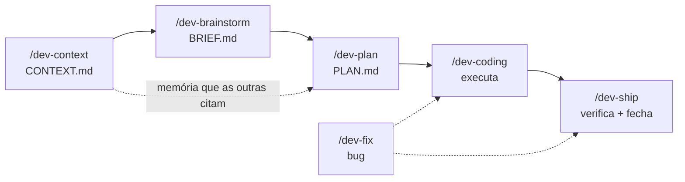

# solodev v2

> **Plan > Vibes.** Sete skills de Claude Code para o dev solo que fala a ideia solta e quer disciplina de engenharia do outro lado.

[](https://github.com/Marcelover777/solodev-v2/actions/workflows/validate.yml)

<sub>English version: [README.en.md](README.en.md)</sub>

Você descreve a ideia do seu jeito — por voz, por fluxo de consciência, misturando o quê com o porquê. Do outro lado, em vez de um sim-senhor que sai codando o primeiro palpite, você tem um engenheiro que te grilla antes de planejar, escreve um plano atômico que sobrevive a um `/clear`, executa task a task sem inflar escopo, e só diz "pronto" quando **demonstra** pronto. É o anti-vibe-coding: a ideia continua sendo sua, a disciplina vem de graça.

## O ciclo de vida



Fallback (pra quem não renderiza mermaid):

```
/dev-context  →  /dev-brainstorm  →  /dev-plan  →  /dev-coding  →  /dev-ship
  CONTEXT.md        BRIEF.md           PLAN.md       executa         verifica + fecha
  (1x por projeto)                                      ↑
                                                    /dev-fix  (bugs, a qualquer momento)
```

`/dev-context` roda uma vez por projeto (ou quando a arquitetura muda) e gera o `CONTEXT.md` que brainstorm, plan, coding e ship citam quando precisam falar a língua do projeto. O resto é o loop: ideia → BRIEF → PLAN → execução → ship. `/dev-fix` entra a qualquer hora que algo quebra.

Baseado no [solodev](https://github.com/calneymgp/solodev) original (3 skills), estendido para o ciclo de vida completo. Formato Claude Code, conteúdo em PT-BR.

## O que cada skill faz

| Skill | Quando | O que entrega |
|-------|--------|---------------|
| `/dev-context` | Começo de projeto, ou a arquitetura mudou | `CONTEXT.md` na raiz: one-liner do projeto, mapa de arquitetura, glossário canônico, convenções, invariantes ("nunca faça X"), comandos (build/test/lint/run) e boundaries externos. A memória que as outras skills citam. |
| `/dev-brainstorm` | Ideia bruta, falada, difusa | Espelho de entendimento → triagem S/M/L → grilling 1-pergunta-por-vez com recomendação inline → explora o codebase em silêncio → `BRIEF.md` ao vivo → fecha com Risk Radar |
| `/dev-plan` | BRIEF fechado | `PLAN.md` atômico: vertical slices, acceptance verificável (grep/test/build), effort + rollback por task, pontos de `/clear`, Must-Haves + Demo script de 60s, Reset Protocol. Sem código no plano. |
| `/dev-coding` | PLAN.md pronto | Executa task a task: lê `read_first`, mostra progresso X/N, guarda de escopo, protocolo de drift, TDD tracer-bullet, commits atômicos `[task-XX]` |
| `/dev-fix` | Bug, a qualquer momento | Triagem trivial/real/arquitetural → modo rápido ou loop de 6 fases (feedback loop → reproduz → hipóteses falsificáveis → 1 probe por hipótese → fix + regressão → cleanup) |
| `/dev-ship` | Última task feita, ou "tá pronto?" | Suite completa + Must-Haves + demo script + revisão de diff (restos, bugs) + lente de segurança + `SUMMARY.md` + arquiva o plano |
| `/dev-help` | Perdido no fluxo | Cartão de referência: o ciclo, qual skill usar agora e onde ficam os outputs (one-shot, não vira modo) |

## Como funciona

O segredo não é o modelo lembrar de tudo — é não precisar lembrar de nada.

- **`BRIEF.md` e `PLAN.md` são memória externa.** As decisões não vivem na conversa, vivem em arquivo. A sessão de chat é descartável.
- **`/clear` fica barato.** O `PLAN.md` é auto-suficiente: uma sessão nova lendo só ele + o `CLAUDE.md` do projeto retoma a feature inteira. O plano até marca onde vale resetar o contexto.
- **O plano sempre conta a verdade.** Quando a realidade do código contradiz o plano, `/dev-coding` não improvisa em silêncio — para, registra o que descobriu, ajusta. A próxima sessão nunca herda uma mentira.
- **`CONTEXT.md` é a camada de baixo de tudo.** Roda uma vez, e a partir daí brainstorm/plan/coding/ship alinham ao vocabulário, às convenções e aos invariantes do projeto em vez de reinventar.

Outputs em `.plans/<feature-slug>/`: `BRIEF.md`, `PLAN.md`, `DISCOVERY.md` (opcional), `SUMMARY.md`. O `CONTEXT.md` fica na raiz do projeto.

## As melhorias do v2

Herdado do original e afiado nesta versão:

- **Espelho de entendimento** — antes de grilhar, devolve em 3 bullets o que entendeu da ideia falada. Mata 80% dos desentendimentos no turn 1.
- **Triagem S/M/L** — tarefa pequena não ganha BRIEF; cerimônia é imposto. Tarefa grande não escapa do grilling.
- **Lente de produto** — estado vazio, erro, loading, permissões: o que vibe coder esquece, a skill pergunta.
- **Risk Radar** — todo BRIEF fecha com top-3 "isso vai te morder" + mitigação.
- **effort + rollback por task** — o plano diz quanto custa e como desfazer o que é perigoso.
- **Pontos de `/clear`** — o plano marca onde resetar contexto; `PLAN.md` é a memória externa, a sessão é descartável.
- **Guarda de escopo + protocolo de drift** — task inflou 2×? Implementação divergiu do plano? Para, registra, re-planeja.
- **`/dev-fix`** — o diagnose loop virou skill própria: bugs não precisam de plano, precisam de método.
- **`/dev-ship`** — "pronto" virou estado verificado: suite + Must-Haves + demo de 60s + diff limpo + security pass.

Novo nesta release:

- **`/dev-context`** — a memória do projeto. `CONTEXT.md` com arquitetura, glossário, convenções e invariantes que as outras skills citam.
- **Plugin de Claude Code** — instala via marketplace, sem clonar nada.
- **Installer cross-platform** — `install.sh` e `install.ps1` para quem prefere script (macOS/Linux/Windows).
- **Exemplo end-to-end** — `examples/realtime-presence/` com `BRIEF.md`, `PLAN.md` e `SUMMARY.md` reais de uma feature passando pelo ciclo inteiro.
- **`/dev-help`** — cartão de referência in-session: qual skill usar agora, sem sair do terminal.
- **Auto-validação em CI** — `scripts/validate.mjs` checa frontmatter das skills, manifests e docs a cada push. A suíte que prega critério verificável valida a si mesma.

## Por que essas melhorias são fodas

Cada uma existe porque previne um modo de falha específico do fluxo "vibe coding". Não é enfeite — é o buraco em que você cai sem ela.

- **Sem triagem S/M/L → cerimônia vira imposto.** Você pede um botão e gasta 10 turns de grilling, BRIEF e PLAN para algo que eram 5 linhas. Ou o contrário: trata uma feature de arquitetura como trivial e descobre o buraco no meio da implementação. A triagem classifica o tamanho na primeira linha e ajusta a cerimônia ao risco.

- **Sem espelho de entendimento → você grilla na direção errada.** A ideia falada é ambígua por natureza. Sem devolver "foi isso que entendi?" no turn 1, as próximas 10 perguntas refinam a interpretação errada. O espelho corta isso antes de gastar contexto à toa.

- **Sem Risk Radar → o risco aparece em produção, não no BRIEF.** A migration sem rollback, o contrato público que muda, a race condition conhecida — vibe coding descobre essas no pior momento. O Risk Radar força você a nomear os top-3 "isso vai te morder" enquanto ainda é barato mudar de rota.

- **Sem lente de produto → a feature liga e quebra no primeiro caso real.** O happy path funciona na demo; o estado vazio mostra `undefined`, o erro "loga no console" e some, a tela trava sem loading. A lente pergunta esses casos no brainstorm, não no bug report do usuário.

- **Sem código-no-plano sob controle → o plano apodrece.** Plano cheio de snippet de implementação fica stale no primeiro refactor e passa a mentir. `/dev-plan` mantém o plano em decisões + acceptance verificável; o código vive no código, onde não envelhece junto.

- **Sem acceptance verificável → "feito" é só sensação.** "Funciona corretamente" não é critério — é vibe. Cada task carrega acceptance checável por grep/test/build, então "feito" tem prova, não opinião.

- **Sem pontos de `/clear` → você teme resetar e o contexto entope.** Quando a memória vive só no chat, dar `/clear` é perder tudo, então você não dá, e a janela enche de ruído de exploração. Com o `PLAN.md` auto-suficiente e os pontos de reset marcados, resetar é grátis e a qualidade das respostas não degrada.

- **Sem protocolo de drift → o plano vira ficção e a próxima sessão herda a mentira.** O modelo descobre que a API não existe como o plano descreve e... improvisa em silêncio. O plano continua dizendo uma coisa, o código faz outra, e a sessão seguinte planeja em cima da versão falsa. O protocolo obriga a registrar a verdade no plano antes de seguir.

- **Sem guarda de escopo → a "correção rápida no caminho" engole a tarde.** A task era tocar 2 arquivos; quatro arquivos depois virou uma sub-feature não planejada. A guarda dispara quando o escopo dobra: para, registra, propõe dividir — em vez de deixar você acordar três horas depois sem saber o que mexeu.

- **Sem TDD tracer-bullet → o teste valida a implementação, não o behavior.** Escrever todos os testes de uma vez, ou mockar colaborador interno, dá verde com behavior quebrado e quebra a cada refactor. Um teste → uma implementação → repete, testando pela interface pública, sobrevive a refactor e pega bug de verdade.

- **Sem Must-Haves → uma task "completa" cria um placeholder vazio.** Task ✅ ≠ goal ✅. "Criar componente Chat" pode completar criando um componente vazio que renderiza nada. Os Must-Haves (Truths, Artifacts, Key Links) e o Demo script verificam que o goal aconteceu de verdade — não que a checkbox foi marcada.

- **Sem feedback loop no `/dev-fix` → o bug vira caça de 3 horas.** A diferença entre 10 minutos e 3 horas é quase sempre a qualidade do loop de reprodução, não a dificuldade do bug. `/dev-fix` constrói primeiro o repro de <10s, depois ranqueia hipóteses falsificáveis e testa uma por vez — em vez de "muda isso e vê se passa", que destrói a informação de qual era a causa.

- **Sem `/dev-ship` → você shippa quando *parece* pronto.** Os testes principais passam, então deve estar ok — e vai um `console.log` de debug, um `catch` vazio e um edge case dos Goals que nenhuma task cobriu junto pra produção. O ship roda suite completa + Must-Haves + demo + revisão de diff com olhos de reviewer + lente de segurança. Pronto vira estado verificado, não sensação.

- **Sem `/dev-context` → cada feature reinventa o vocabulário do projeto.** Sem uma memória canônica, brainstorm chama de "cancelamento" o que o código chama de outra coisa, o plano viola um invariante que ninguém escreveu, e cada sessão redescobre as convenções do zero. O `CONTEXT.md` é a fonte única que as outras skills citam para falar a língua do projeto desde o primeiro turn.

## Instalação

Três formas. Detalhe completo em [INSTALL.md](INSTALL.md).

**1. Plugin do Claude Code (recomendado)** — instala via marketplace, sem clonar nada:

```
/plugin marketplace add Marcelover777/solodev-v2
/plugin install solodev-v2@solodev-v2
```

**2. Script (macOS / Linux / Windows):**

```bash
# macOS / Linux
git clone https://github.com/Marcelover777/solodev-v2 && cd solodev-v2
./install.sh
```

```powershell
# Windows (PowerShell)
git clone https://github.com/Marcelover777/solodev-v2; cd solodev-v2
.\install.ps1
```

**3. Manual** — copie o diretório `skills/` para onde o Claude Code lê suas skills. Passos por sistema em [INSTALL.md](INSTALL.md).

## Workflow

```
0. > /dev-context        1x por projeto; sai CONTEXT.md (a memória que as outras citam)
1. > /dev-brainstorm     fala a ideia do seu jeito; sai BRIEF.md (ou direto pra execução se for S)
2. > /dev-plan           sai PLAN.md auto-suficiente
3. > /clear              (opcional — o plano carrega tudo)
4. > /dev-coding         executa task a task; /dev-fix quando algo quebrar
5. > /dev-ship           só termina o que demonstra funcionando
```

`/dev-context` roda uma vez no começo (ou quando a arquitetura muda) — não por feature. O resto do ciclo se repete a cada feature. Outputs de feature ficam em `.plans/<feature-slug>/`; o `CONTEXT.md` fica na raiz do projeto.

## Créditos

v2 construído sobre o [solodev de calneymgp](https://github.com/calneymgp/solodev) (3 skills), estendido para o ciclo de vida completo + `/dev-context`. Créditos ao original preservados.

Distilado de: [Matt Pocock — skills](https://github.com/mattpocock/skills), [OpenSpec](https://github.com/Fission-AI/OpenSpec), [get-shit-done](https://github.com/gsd-build/get-shit-done), [everything-claude-code](https://github.com/affaan-m/everything-claude-code), e as regras anti-LLM de Karpathy.

MIT — ver [LICENSE](LICENSE).
