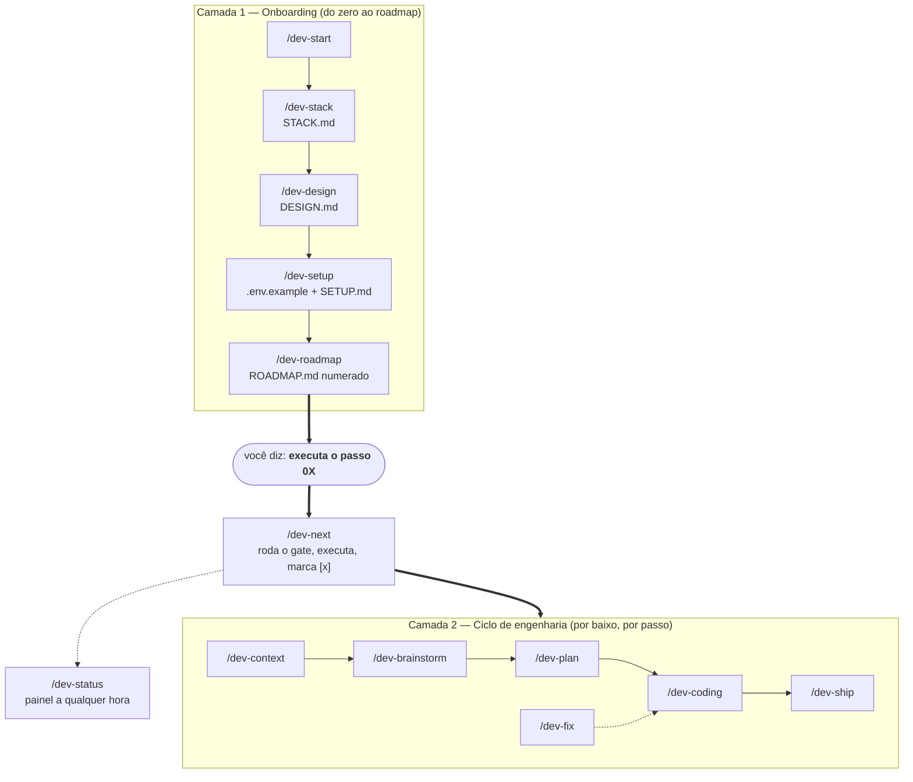

# solodev v3

> **Plan > Vibes.** Quinze skills de Claude Code que levam o dev solo da ideia ao deploy — aprendendo um comando só: *executa o passo 0X*.

[](https://github.com/Marcelover777/solodev-v2/actions/workflows/validate.yml)

<sub>English version: [README.en.md](README.en.md)</sub>

Você fala a ideia do seu jeito — por voz, por fluxo de consciência, misturando o quê com o porquê. Do outro lado, em vez de um sim-senhor que sai codando o primeiro palpite, você ganha um engenheiro: ele escolhe e explica o stack, deixa o projeto bonito de saída, mapeia as chaves que você vai precisar, e monta uma **lista numerada de passos**. A partir daí, o único comando que você precisa decorar é **"executa o passo 01"**. É o anti-vibe-coding: a ideia continua sendo sua, a disciplina vem de graça.

## O que mudou no v3

O solodev v2 já cobria a **disciplina de engenharia** de UMA feature (brainstorm → plano → execução → ship). Era ótimo para quem já sabia o que estava fazendo.

O v3 envelopa isso numa **camada de onboarding** para quem está começando. Você não precisa mais saber por onde começar: o `/dev-start` pega sua ideia bruta e, mostrando o que está montando a cada etapa, deixa pronto o **stack escolhido**, o **projeto estético**, o **mapa das chaves** e um **`ROADMAP.md` numerado**. Depois é só pedir o próximo passo. Quando faltar uma chave de API, o sistema **para e te dá o link exato** — nunca avança quebrado.

São **duas camadas**: a de **onboarding** (do zero ao roadmap) por cima, e o **ciclo** de engenharia do v2 por baixo. Cada "passo" do roadmap aciona o ciclo certo automaticamente.

## As duas camadas



Fallback (pra quem não renderiza mermaid):

```
Camada 1 — ONBOARDING (do zero ao roadmap)
  /dev-start ─┬─▶ /dev-stack   → STACK.md          (que infra? por quê?)
              ├─▶ /dev-design  → DESIGN.md         (bonito de saída)
              ├─▶ /dev-setup   → .env.example + SETUP.md (que chaves?)
              └─▶ /dev-roadmap → ROADMAP.md        (a lista numerada)

            ↓  você aprende UM verbo:
            ╔═══════════════════════════╗
            ║   executa o passo 0X      ║  →  /dev-next
            ╚═══════════════════════════╝
                 │  roda o gate (falta chave? PARA e dá o link)
                 │  delega ao ciclo abaixo, marca [x], imprime o próximo
                 ▼
Camada 2 — CICLO (por baixo, em cada passo)
  /dev-context → /dev-brainstorm → /dev-plan → /dev-coding → /dev-ship
                                                   ↑
                                              /dev-fix (bug, a qualquer hora)

  /dev-status  →  a qualquer momento: o que está pronto, com erro, e a qualidade
```

A camada de cima é onde o iniciante entra. A de baixo é a disciplina herdada do v2 — você não precisa chamá-la na mão: cada passo do roadmap aciona a skill certa por você.

## Para quem está começando

Nunca programou? Esse é o caminho feliz. Você só toma **uma decisão por vez** e nada acontece em silêncio.

1. **`/dev-start`** — fala sua ideia uma vez ("quero um site que vende meus quadros", "um app de lista de tarefas"). O solodev devolve em poucas linhas o que entendeu, confirma com você, e então monta tudo: escolhe a infra e explica o porquê, deixa a aparência pronta, mapeia as chaves, e escreve o **`ROADMAP.md`** — a lista numerada de passos do seu projeto. No fim, ele te diz a única frase que você precisa decorar:

   > Agora é só pedir: **executa o passo 01**.

2. **"executa o passo 01"** — o solodev faz o passo, marca como concluído ✅ no roadmap, registra o que mudou, e te avisa o próximo: *"próximo: executa o passo 02"*. Você repete. Esse é o ritmo do projeto inteiro.

3. **Os gates te protegem.** Se um passo precisa de uma chave que você ainda não pegou (a chave do banco de dados, a do pagamento), o solodev **não tenta adivinhar e não quebra**: ele para e te entrega o link exato de onde pegar a chave, em texto mastigado. Você resolve, pede o passo de novo, e segue.

4. **`/dev-status` quando quiser saber onde está.** A qualquer momento, esse comando mostra um painel honesto: quanto do projeto já andou, o que tem erro, a qualidade de cada parte e qual o próximo passo. Tudo lido de arquivos reais — nada de número inventado. Perdido sobre o que fazer? **`/dev-help`** mostra o mapa de comandos.

É isso. Um verbo ("executa o passo 0X"), um painel (`/dev-status`) e gates que te seguram quando falta algo. Você não precisa entender git, deploy ou variável de ambiente para começar — o solodev explica cada peça quando ela aparece.

## As 15 skills

Duas camadas, mais a referência. Iniciante começa por `/dev-start`; usuário avançado chama as skills direto.

### Onboarding — do zero ao `ROADMAP.md`

| Skill | Quando | O que entrega |
|-------|--------|---------------|
| `/dev-start` | Tenho uma ideia e não sei por onde começar | A porta de entrada guiada. Espelha a ideia, encadeia stack → design → setup → roadmap mostrando o que monta em cada etapa, e termina dizendo *"executa o passo 01"*. Orquestra as outras — não reimplementa. |
| `/dev-stack` | Que infra eu uso? Que banco? É grátis? | Advisor de stack/conectores: infere o arquétipo, recomenda o default + o porquê em 1 linha, oferece 1 alternativa, avisa os gotchas de free-tier e **linka a pricing oficial**. Escreve `STACK.md` (um ADR). |
| `/dev-design` | Quero que já saia bonito, sem cara de template | Estética instantânea. No arquétipo web, scaffolda Tailwind v4 + shadcn/ui + um tema tweakcn. Lê o `BRIEF.md` pro tom, escreve `DESIGN.md` e emite os comandos de scaffold. |
| `/dev-setup` | O projeto pede uma chave e eu não sei de onde tirar | Lê o `STACK.md` + varre o código e gera um `.env.example` anotado (o que é cada var, onde pegar, obrigatória ou não) e um `SETUP.md` (checklist com o link exato de cada chave). Garante o `.gitignore`. |
| `/dev-roadmap` | Quero a lista de passos do projeto | Transforma ideia/`CONTEXT.md`/`BRIEF.md` na lista numerada: `ROADMAP.md` na raiz + um `.plans/steps/0X-*.md` por passo. Cada passo é uma fatia demoável, com objetivo, gates e dependências. |
| `/dev-next` | "executa o passo 0X" | O motor de execução. Resolve o próximo passo (ou um nomeado), **roda os gates primeiro** (falta chave? para e dá o link), delega ao ciclo, marca `[x]` no roadmap, registra o progresso e imprime o próximo passo. |
| `/dev-status` | Como está o projeto? O que falta? | Painel derivado de arquivo real: % de progresso, qualidade por parte (build/test/lint/security ✅/⚠️/❌), erros, blockers e o próximo passo. Escreve `.solodev/STATUS.md`. Modo `jornada` = resumo narrativo motivacional. |
| `/dev-ops` | Configura o GitHub / não quero entender git | Git/GitHub no automático: scaffolda `.github/*` (CI, dependabot, templates de PR/issue), escreve um `GITHUB.md` que explica tudo pra leigo, define o timing de testes no `TESTING.md` e oferece (opt-in) hooks de auto-commit e limpeza de worktree. |

### Ciclo — a disciplina de engenharia de uma feature (herdado do v2)

| Skill | Quando | O que entrega |
|-------|--------|---------------|
| `/dev-context` | Começo de projeto, ou a arquitetura mudou | `CONTEXT.md` na raiz: one-liner, mapa de arquitetura, glossário canônico, convenções, invariantes ("nunca faça X") e comandos. A memória de vocabulário que as outras skills citam. |
| `/dev-brainstorm` | Ideia bruta, falada, difusa | Espelho de entendimento → triagem S/M/L → grilling 1-pergunta-por-vez com recomendação inline → explora o codebase em silêncio → `BRIEF.md` ao vivo → fecha com Risk Radar. |
| `/dev-plan` | BRIEF fechado | `PLAN.md` atômico: vertical slices, acceptance verificável, effort + rollback por task, pontos de `/clear`, Must-Haves + demo script. Sem código no plano — auto-suficiente para retomar após reset. |
| `/dev-coding` | PLAN.md pronto | Executa task a task: lê `read_first`, mostra progresso X/N, guarda de escopo, protocolo de drift, TDD tracer-bullet, commits atômicos `[task-XX]`. |
| `/dev-fix` | Bug, a qualquer momento | Triagem trivial/real/arquitetural → modo rápido ou loop disciplinado (feedback loop → reproduz → hipóteses falsificáveis → 1 probe por hipótese → fix + regressão → cleanup). |
| `/dev-ship` | Última task feita, ou "tá pronto?" | Verificação goal-backward: suite + Must-Haves + demo script + revisão de diff (restos, bugs) + lente de segurança + `SUMMARY.md` + arquiva o plano. Pronto vira estado verificado, não sensação. |

### Referência

| Skill | Quando | O que entrega |
|-------|--------|---------------|
| `/dev-help` | Me perdi / qual skill uso agora? | Mapa de comandos do v3 — as duas camadas, qual skill usar em cada momento, o que entrega e onde ficam os outputs. One-shot: exibe e sai, não vira modo. |

## Infra e conectores (o advisor do `/dev-stack`)

O iniciante trava na infra: banco? auth? onde faz deploy? é grátis? O `/dev-stack` responde com **recomendação opinativa + o porquê em 1 linha + 1 alternativa**, avisa as armadilhas de free-tier, e **linka a página oficial de pricing** — nunca crava um preço ou limite (eles mudam rápido). Tudo vira um `STACK.md` que o `/dev-setup` e o `/dev-design` leem.

| Seu projeto é… | Default recomendado | Alternativa |
|----------------|---------------------|-------------|
| Site estático / SPA | Cloudflare Pages (ou Vercel se Next.js) | Netlify |
| Web app full-stack (auth + banco) — *o caso comum* | Vercel + Supabase | Vercel + Neon + Clerk |
| API / backend | Render | Railway |
| Jobs / cron / workflows longos | Trigger.dev | Inngest |
| App de IA (chat / RAG) | Vercel + Anthropic API + Supabase (pgvector) | Neon (pgvector) + OpenAI |
| App realtime (presença / colaboração) | Supabase Realtime | Cloudflare Workers + Durable Objects |

> **Sobre preço:** o `/dev-stack` e o `/dev-setup` **nunca cravam um valor ou limite de free-tier** — eles linkam a pricing oficial de cada serviço, porque esses números mudam toda hora. O que você lê aqui é a escolha; o preço você confere na fonte.

## Estética de saída (`/dev-design`)

O diferencial do v3 é o projeto **já nascer com aparência desenhada**, não com o cinza-genérico de bootstrap. Para o arquétipo web (o padrão), o `/dev-design` recomenda e scaffolda o combo **Tailwind v4 + shadcn/ui + um tema tweakcn** (daisyUI como atalho mais rápido; Tremor para dashboards). Ele lê o `BRIEF.md` para pegar o tom certo, escreve o `DESIGN.md` (tokens, componentes instalados, convenções de nome) e emite os comandos de scaffold como um passo do roadmap. Para arquétipos não-web, degrada com elegância. As versões das libs você confere na hora — mudam rápido.

## Git/GitHub no automático (`/dev-ops`)

O iniciante não quer saber o que é branch, PR ou CI. Quer que o código suba seguro, que o robô rode os testes e que ninguém quebre a `main` sem aviso. O `/dev-ops` **scaffolda os arquivos** que fazem isso — `.github/workflows/ci.yml` (lint + typecheck + unit), `dependabot.yml`, templates de PR e de issue — e escreve um `GITHUB.md` que explica em um parágrafo cada: o que é Actions, PR, CI, issue, branch. Define o timing de testes no `TESTING.md` (lint on-save, unit on-push, e2e só em PR-pra-main / nightly), abre PR via `gh pr create --fill`, e **oferece** (nunca impõe) hooks opt-in de auto-commit e limpeza de worktree. Nada escreve no histórico sem você ligar explicitamente — nunca um push silencioso para `main`.

## Instalação

Três formas. Detalhe completo em [INSTALL.md](INSTALL.md).

**1. Plugin do Claude Code (recomendado)** — instala via marketplace, sem clonar nada:

```
/plugin marketplace add Marcelover777/solodev-v2
/plugin install solodev-v2@solodev-v2
```

> Pelo plugin, as skills aparecem **namespaced**: `/solodev-v2:dev-start`, `/solodev-v2:dev-next`, etc. Os comandos puros (`/dev-start`, …) valem para os métodos de script e manual abaixo.

**2. Script (macOS / Linux / Windows):**

```bash
# macOS / Linux
curl -fsSL https://raw.githubusercontent.com/Marcelover777/solodev-v2/main/install.sh | bash
```

```powershell
# Windows (PowerShell)
irm https://raw.githubusercontent.com/Marcelover777/solodev-v2/main/install.ps1 | iex
```

**3. Manual** — copie a pasta `skills/` para onde o Claude Code lê suas skills (`.claude/skills/` por projeto ou `~/.claude/skills/` global). Passos por sistema em [INSTALL.md](INSTALL.md).

## O que tem dentro

- **15 skills** em duas camadas — onboarding (`dev-start`, `dev-stack`, `dev-design`, `dev-setup`, `dev-roadmap`, `dev-next`, `dev-status`, `dev-ops`) e ciclo (`dev-context`, `dev-brainstorm`, `dev-plan`, `dev-coding`, `dev-fix`, `dev-ship`), mais a referência `dev-help`.
- **Memória file-based** — `.solodev/PROGRESS.md` (journal do que andou) e `.solodev/STATUS.md` (painel), sem worker, sem banco, sem porta: só Markdown que renderiza no GitHub.
- **Artefatos por projeto** — `ROADMAP.md` + `.plans/steps/0X-*.md`, `STACK.md`, `DESIGN.md`, `SETUP.md` + `.env.example`, `GITHUB.md`, `CONTEXT.md`, e por feature `.plans/<feature>/{BRIEF,PLAN,SUMMARY}.md`.
- **Plugin + installer cross-platform** — `install.sh` e `install.ps1` para quem prefere script.
- **Auto-validação em CI** — `scripts/validate.mjs` checa frontmatter das skills, manifests e docs a cada push. A suíte que prega critério verificável valida a si mesma.

Um princípio guia tudo: o **espelho de entendimento** do brainstorm devolve em 3 bullets o que entendeu antes de planejar — mata 80% dos desentendimentos no turn 1.

## Créditos

Construído sobre o [solodev de calneymgp](https://github.com/calneymgp/solodev) (3 skills v1), estendido para o ciclo completo no v2 e envelopado na camada de onboarding no v3. Créditos ao original preservados.

Distilado de: [Matt Pocock — skills](https://github.com/mattpocock/skills), [OpenSpec](https://github.com/Fission-AI/OpenSpec), [get-shit-done](https://github.com/gsd-build/get-shit-done), [everything-claude-code](https://github.com/affaan-m/everything-claude-code), e as regras anti-LLM de Karpathy.

MIT — ver [LICENSE](LICENSE).
